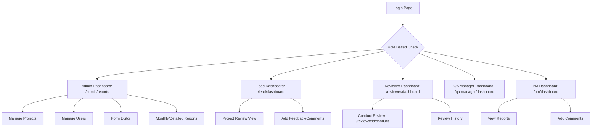
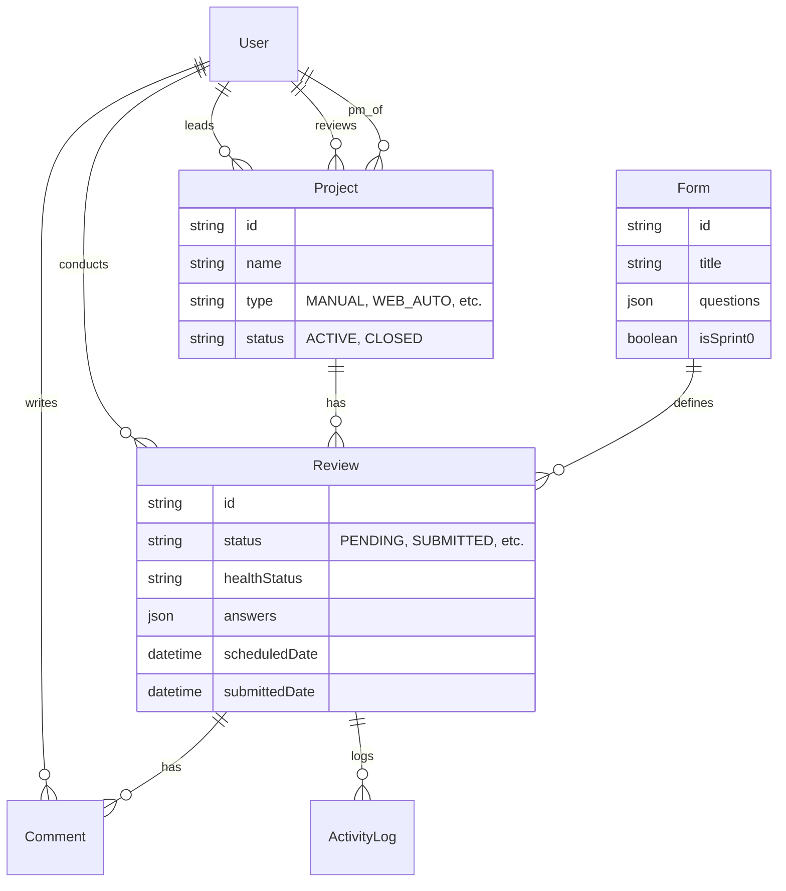
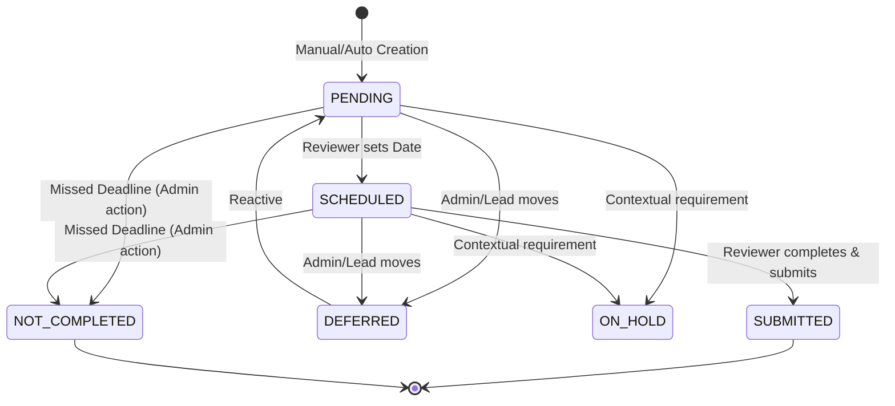
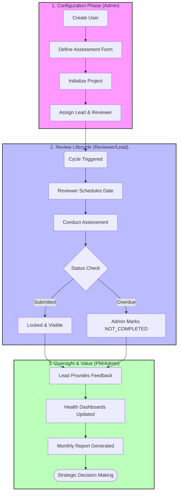
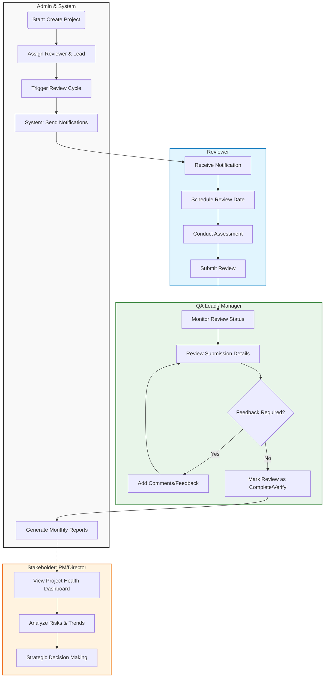
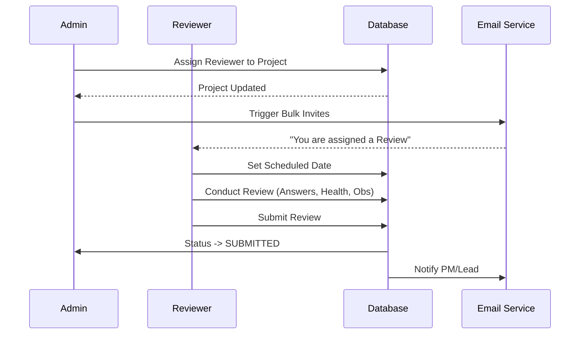
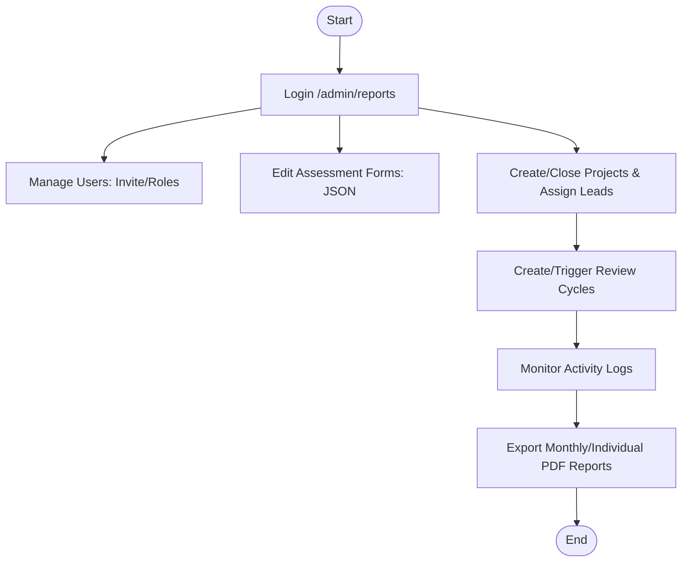
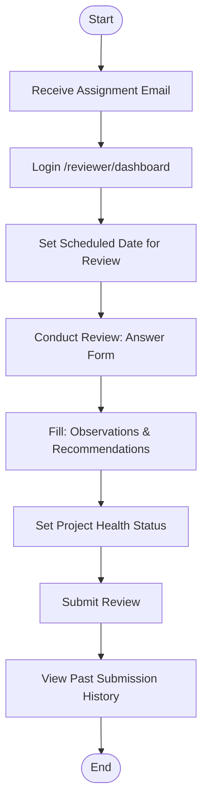
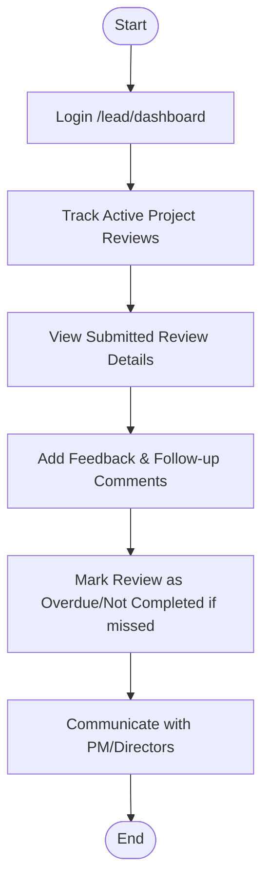
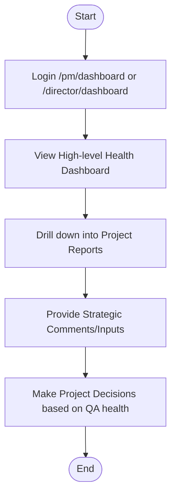

# Application Overview & User Flows

This document provides a technical overview of the QA Review App architecture and the key user journeys across different roles.

## System Architecture

### 🗺️ Navigation & Site Map
Shows the core pages and access paths for the various user roles.

### 📊 Data Model (Core Entities)

### 🔐 User Roles & Dashboards

| Role | Responsibility | Dashboard Path |
| :--- | :--- | :--- |
| **Admin / QA Head** | System & User Mgmt, Full Reporting | `/admin/reports` |
| **QA Manager / Architect** | Project & Review Oversight | `/qa-manager/dashboard` |
| **Review Lead** | Leading Project Review Cycles | `/lead/dashboard` |
| **Reviewer** | Scheduling and Conducting Reviews | `/reviewer/dashboard` |
| **PM / Director** | Monitoring Health & Providing Feedback | `/pm/dashboard` |
| **Contact Person** | Viewing Assigned Project Reports | `/contact-person/dashboard` |

---

### 🔄 Review Lifecycle State Diagram
Describes the state transitions of a Review entity.

### 🚀 Master Application Workflow
The comprehensive end-to-end journey of a project review.

### 🏊 Detailed Swimlane Workflow
This diagram visualizes the process flow across different roles, highlighting the interactions and handoffs.

[View Detailed Swimlane Workflow on Mermaid Live Editor](https://mermaid.live/edit#base64:eyJjb2RlIjoiZ3JhcGggVERcbiAgICBzdWJncmFwaCBBZG1pbl9TeXN0ZW0gW0FkbWluICYgU3lzdGVtXVxuICAgICAgICBkaXJlY3Rpb24gVEJcbiAgICAgICAgQTEoU3RhcnQ6IENyZWF0ZSBQcm9qZWN0KVxuICAgICAgICBBMltBc3NpZ24gUmV2aWV3ZXIgJiBMZWFkXVxuICAgICAgICBBM1tUcmlnZ2VyIFJldmlldyBDeWNsZV1cbiAgICAgICAgQTRbU3lzdGVtOiBTZW5kIE5vdGlmaWNhdGlvbnNdXG4gICAgICAgIEE1W0dlbmVyYXRlIE1vbnRobHkgUmVwb3J0c11cbiAgICBlbmRcblxuICAgIHN1YmdyYXBoIFJldmlld2VyX1JvbGUgW1Jldmlld2VyXVxuICAgICAgICBkaXJlY3Rpb24gVEJcbiAgICAgICAgUjFbUmVjZWl2ZSBOb3RpZmljYXRpb25dXG4gICAgICAgIFIyW1NjaGVkdWxlIFJldmlldyBEYXRlXVxuICAgICAgICBSM1tDb25kdWN0IEFzc2Vzc21lbnRdXG4gICAgICAgIFI0W1N1Ym1pdCBSZXZpZXddXG4gICAgZW5kXG5cbiAgICBzdWJncmFwaCBRQV9MZWFkIFtRQSBMZWFkIC8gTWFuYWdlcl1cbiAgICAgICAgZGlyZWN0aW9uIFRCXG4gICAgICAgIEwxW01vbml0b3IgUmV2aWV3IFN0YXR1c11cbiAgICAgICAgTDJbUmV2aWV3IFN1Ym1pc3Npb24gRGV0YWlsc11cbiAgICAgICAgTDN7RmVlZGJhY2sgUmVxdWlyZWQ/fVxuICAgICAgICBMNFtBZGQgQ29tbWVudHMvRmVlZGJhY2tdXG4gICAgICAgIEw1W01hcmsgUmV2aWV3IGFzIENvbXBsZXRlL1ZlcmlmeV1cbiAgICBlbmRcblxuICAgIHN1YmdyYXBoIFN0YWtlaG9sZGVyIFtTdGFrZWhvbGRlcjogUE0vRGlyZWN0b3JdXG4gICAgICAgIGRpcmVjdGlvbiBUQlxuICAgICAgICBTMVtWaWV3IFByb2plY3QgSGVhbHRoIERhc2hib2FyZF1cbiAgICAgICAgUzJbQW5hbHl6ZSBSaXNrcyAmIFRyZW5kc11cbiAgICAgICAgUzNbU3RyYXRlZ2ljIERlY2lzaW9uIE1ha2luZ11cbiAgICBlbmRcblxuICAgIEExIC0tPiBBMlxuICAgIEEyIC0tPiBBM1xuICAgIEEzIC0tPiBBNFxuICAgIEE0IC0tPiBSMVxuXG4gICAgUjEgLS0+IFIyXG4gICAgUjIgLS0+IFIzXG4gICAgUjMgLS0+IFI0XG5cbiAgICBSNCAtLT4gTDFcbiAgICBMMSAtLT4gTDJcbiAgICBMMiAtLT4gTDNcbiAgICBcbiAgICBMMyAtLSBZZXMgLS0+IEw0XG4gICAgTDQgLS0+IEwyXG4gICAgTDMgLS0gTm8gLS0+IEw1XG5cbiAgICBMNSAtLT4gQTVcbiAgICBBNSAtLi0+IFMxXG4gICAgUzEgLS0+IFMyXG4gICAgUzIgLS0+IFMzXG5cbiAgICBzdHlsZSBBZG1pbl9TeXN0ZW0gZmlsbDojZjlmOWY5LHN0cm9rZTojMzMzLHN0cm9rZS13aWR0aDoycHhcbiAgICBzdHlsZSBSZXZpZXdlcl9Sb2xlIGZpbGw6I2UxZjVmZSxzdHJva2U6IzAyNzdiZCxzdHJva2Utd2lkdGg6MnB4XG4gICAgc3R5bGUgUUFfTGVhZCBmaWxsOiNlOGY1ZTksc3Ryb2tlOiMyZTdkMzIsc3Ryb2tlLXdpZHRoOjJweFxuICAgIHN0eWxlIFN0YWtlaG9sZGVyIGZpbGw6I2ZmZjNlMCxzdHJva2U6I2VmNmMwMCxzdHJva2Utd2lkdGg6MnB4IiwibWVybWFpZCI6eyJ0aGVtZSI6ImRlZmF1bHQifSwiYXV0b1N5bmMiOnRydWUsInVwZGF0ZURpYWdyYW0iOnRydWV9)

### 🛣️ End-to-End Review Sequence
Shows the interaction between different actors in the system.

---

---

## Role-Specific User Flows

### 👨‍💼 Admin / QA Head Workflow
Focus: Governance, Setup, and System Maintenance.

### 🔍 Reviewer Workflow
Focus: Actioning assignments and technical assessments.

### 👔 Lead / QA Manager Workflow
Focus: Quality oversight, team management, and closure.

### 🤝 Stakeholder Workflow (PM / Director / Architect)
Focus: Visibility, alignment, and strategic feedback.

---

## Technical Details
